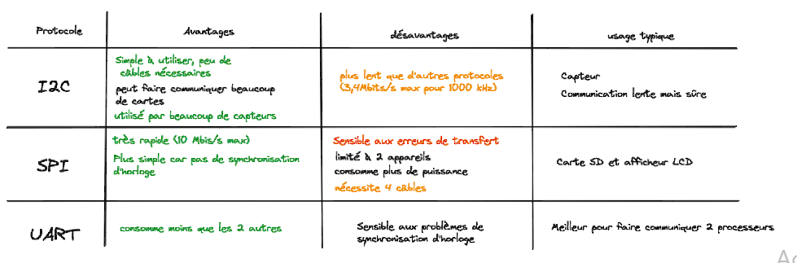
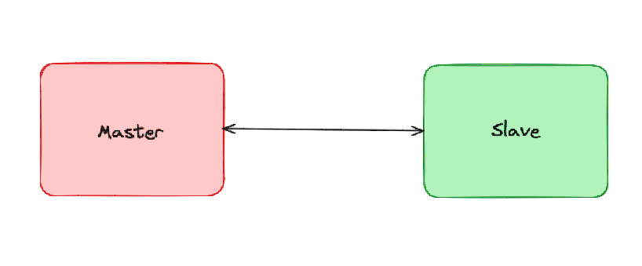
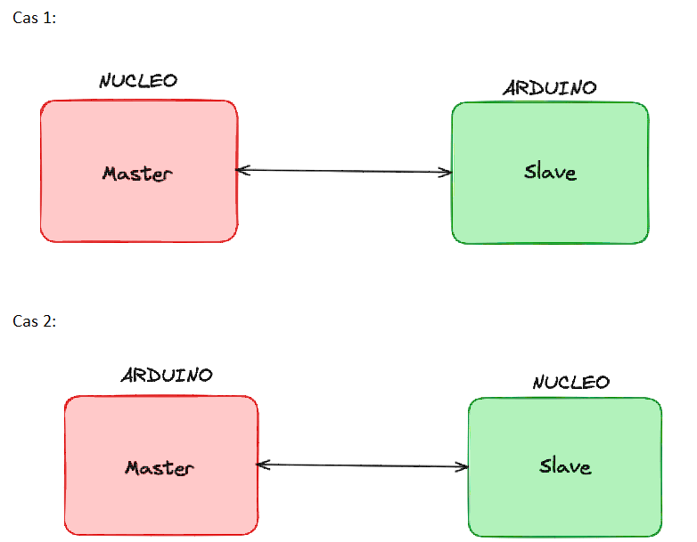

La communication entre cartes.
Avec la structure globale de notre système embarqué, on ne peut pas tout faire avec une seule carte donc on doit utiliser plusieurs cartes: une carte pour acquérir les données des accéléromètre et l'autre pour enregistrer les données dans une carte SD.
Si le système globale comporte au minimum 2 cartes il faut pouvoir les faire communiquer simplement. 
La question est donc, comment faire communiquer 2 cartes ?
Plusieurs méthode de com sont possibles:
 

Dans notre cas, échanger des messages à 400kHz serait déjà trop. On a donc pas d'intérêt à choisir le SPI. De plus, une grande quantité de capteur fonctionne en I2C, on économise du temps à développer l'I2C comme communicaion entre carte et capteur ET entre carte et carte. Le choix de l'I2C est donc plutôt raisonnable.

Notre objectif est donc à terme de faire communiquer les cartes en I2C.

Comment mettre en place la communication I2C ?
Dans ce protocole de communication, les cartes jouent 2 rôle: une carte joue le rôle de "master" et l'autre joue le rôle de "slave". La question devient donc, comment développer un master et un slave ?

 

On peut profiter du fait que les cartes arduino peuvent aussi utiliser l'I2C pour en faire des outils de développement qui joue le rôle complémentaire de notre carte Nucléo stm32.

Sans rentrer trop dans les détails techniques ( puisque d'autres sites le font mieux que moi ), je propose le plan d'action suivant:

1) Réalisation d'un Proof Of Concept ( POC ). L'idée est de mettre en place la com dans le cas le plus simple possible pour commencer plus facilement. Par exemple, ça peut être l'échange d'une seule donnée pour commencer et dans un seul cas, le cas 1.
	1.1) écrire le code arduino 
	1.2.1) Installer STM32CubeMX, l'éditeur de code pour la carte nucleo
	1.2.2) écrire le code nucleo
	1.3) tester  réellement le code en branchant les cartes. (et débugger parce que 		y'aura toujours quelque chose qui va pas)
2) Réalisation du POC mais dans le 2 ème cas.
3) Si le POC est validé on avance sur quelquechose de plus concret. On définit préçisement les besoins en terme de quantité de données à échanger, la structure et on optimise. 
Pour le POC je conseil de suivre ce tuto qui à l'air très complet:
https://circuitdigest.com/microcontroller-projects/stm32-stm32f103c8-i2c-communication-tutorial
